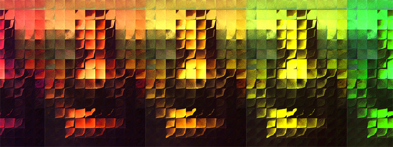

# Processing: An Open-Source Platform for Education and Artistic Expression

Our April 16th FOSUG meeting will be presented by educator and digital artist Jacob Joaquin. Jacob will give a demonstration of Processing, "a flexible software sketchbook and a language for learning how to code within the context of the visual arts." Processing was originally conceived as a tool for teaching the fundamentals of computation but has also transformed into a visual medium for artistic expression, becoming the premiere platform for many works both big and small. Processing is actively being used for education worldwide in high schools, colleges, and MOOCs, including NYU, UCLA, and KhanAcademy.org. There are versions of Processing for Java and Javascript, and plays well with physical computing devices such as Arduino and Raspberry Pi.

Visit https://processing.org and http://p5js.org/.

#### About the Presenter:

Jacob Joaquin started learning computer programming in the early 1980s on a BASIC cartridge for the Atari 400. During the pre-World Wide Web era, he hosted his own electronic Bulletin Board System specializing in file-trading original music. He received a Music Synthesis Degree from Berklee College of Music, and a Master's Degree in Composition: New Media and Integrated Media from the California Institute of the Arts. Jacob is an active participant in the Maker Movement; he is a founding member of two Hackerspaces: Hack Rock City, an international collaborative of artists and makers, and Fresno Ideaworks, a local community makerspace. As an artist, Jacob has performed in the Boston CyberArts Festival and the CEAIT Festival. Jacob has presented works at NYC Resistor, Crash Space (Los Angeles), the San Mateo Maker Faire, and Burning Man. Jacob is also the co-founder and CEO of LoomAcademics.com.
